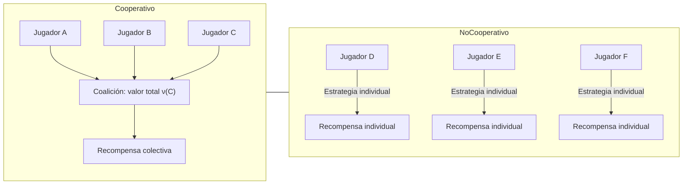

## Teoría de Juegos Combinatorios (CGT)

### Definición

- Rama de matemáticas e informática teórica.
- Estudia **juegos secuenciales de información perfecta**.
- Normalmente se centra en **dos jugadores** que se alternan en movimientos.
- No estudia tradicionalmente **juegos de azar o información imperfecta**.

### Características

- Juegos secuenciales → Representación en **árbol de juego**.
- Juegos de **un jugador** (rompecabezas) y **autómatas sin jugador** pueden considerarse bajo ciertas extensiones.
- Diferencia con teoría de juegos tradicional: CGT enfatiza **análisis teórico** sobre algoritmos prácticos.

### Conceptos Clave

1. **Juego resuelto**: Secuencia óptima de movimientos conocida (ej. Tic-tac-toe → empate si ambos juegan óptimamente).
2. **Juegos imparciales**: Todos los movimientos disponibles para un jugador están disponibles para el otro (ej. Nim).
3. **Juegos partisanos**: Cada jugador tiene movimientos exclusivos (ej. Hackenbush azul-rojo).
4. **Suma de juegos**: Combina varios juegos; gana quien deja sin movimientos a su oponente en todos los juegos.
5. **Notación combinatoria {L | R}**:

   - `L` → movimientos posibles del jugador izquierdo.
   - `R` → movimientos posibles del jugador derecho.
   - Juego cero `0 = {|}` → pierde el jugador que mueve.
   - Estrella `* = {0|0}` → victoria para el primer jugador.
   - Up `↑ = {0 | *}` → infinitesimal positivo.
   - Down `↓ = {* | 0}` → infinitesimal negativo.

### Tipos de juegos

| Tipo      | Características                                    | Ejemplo                           |     |
| --------- | -------------------------------------------------- | --------------------------------- | --- |
| Impartial | Movimientos iguales para ambos                     | Nim                               |     |
| Partisan  | Movimientos distintos por jugador                  | Hackenbush azul-rojo, Domineering |     |
| Calientes | Ventaja inmediata para el jugador que se mueve     | ±1 = {1                           | -1} |
| Nimbers   | Generalización de juegos imparciales con ordinales | Nim extendido                     |     |

### Historia

- 1930s → Teorema de Sprague-Grundy: juegos imparciales equivalen a montones de Nim.
- 1960s → Berlekamp, Conway, Guy desarrollan **juegos partisanos**.
- 1976 → Conway publica _On Numbers and Games_ (introducción de números surreales).
- 1982 → _Winning Ways for your Mathematical Plays_ recopila teoría y ejemplos.

### Ejemplos Clásicos

- **Juegos combinatorios triviales**: Tic-tac-toe.
- **Juegos no triviales**: Ajedrez, damas, go, Nim, Domineering.
- **Rompecabezas combinatorios**: Sudoku.
- **Autómatas sin jugador**: Juego de la vida de Conway.

### Aplicaciones

- Inteligencia artificial: planificación y programación automatizada.
- Matemática pura: análisis de **finales de juego**, medidas de complejidad, existencia de soluciones óptimas.

