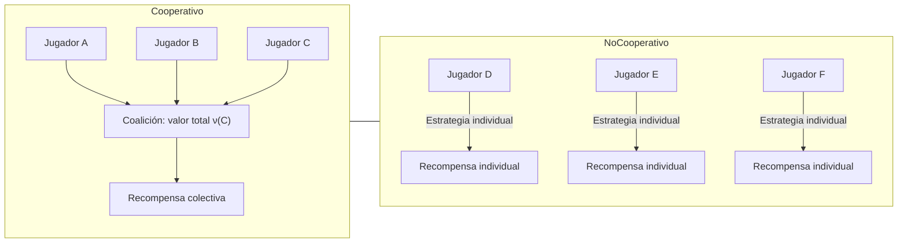

# Teoría de Juegos: Guía Completa sobre Interacción Estratégica

## Introducción: Naturaleza y Alcance

La **teoría de juegos** es una rama de las matemáticas que estudia las interacciones estratégicas entre agentes racionales mediante modelos formales denominados "juegos". Su base matemática permite abstraer escenarios donde los intereses de los participantes se cruzan, y cada decisión influye en los resultados de los demás.

A diferencia de la optimización clásica, donde se compite contra un entorno pasivo, en teoría de juegos se enfrenta a **agentes que también eligen, anticipan y reaccionan**. El resultado de cada participante depende no solo de sus propias decisiones, sino también de las decisiones de otros.

### Ejemplos de Interacción Estratégica

- **Ajedrez**: cada movimiento responde al del rival
- **Negociación salarial**: cada parte ajusta su oferta según la otra
- **Fijación de precios**: una empresa baja precios y provoca respuestas en cadena
- **Conflictos internacionales**: cada Estado anticipa las reacciones de otros
- **Evolución biológica**: estrategias de supervivencia que persisten bajo presión selectiva

### Historia y Desarrollo

Inicialmente formulada por Antoine Augustin Cournot en términos económicos y desarrollada formalmente por John von Neumann y Oskar Morgenstern, esta disciplina se ha expandido hacia la informática, la biología, la sociología, la psicología, la filosofía y el derecho, entre otros campos.

---

## 1. Fundamentos del Modelo

### 1.1 Componentes Básicos

Todo modelo de teoría de juegos se define mediante la terna $\{N, S, U\}$:

1. **Jugadores ($N$)**: Agentes racionales que toman decisiones ($i \in N$)

2. **Estrategias ($S$)**: El conjunto de acciones posibles para cada jugador ($S_i$)

3. **Pagos/Utilidades ($U$)**: Una función $u_i: S_1 \times \ldots \times S_n \to \mathbb{R}$ que asigna un valor al resultado del jugador $i$ dada su acción $s_i$ y las acciones de los demás $s_{-i}$

Estos tres elementos convierten una situación real en un **modelo formal analizable**.

### 1.2 Clasificación de Juegos

La teoría de juegos clasifica los escenarios según múltiples dimensiones:

| Dimensión | Tipos | Significado |
| --------------- | ------------------------------ | -----------------------------------------s------------- |
| **Relación** | Cooperativos / No cooperativos | ¿Se permiten acuerdos vinculantes? |
| **Momento** | Simultáneos / Secuenciales | ¿Se decide a la vez o por turnos? |
| **Información** | Completa / Incompleta | ¿Conoces las reglas y tipos de los demás? |
| **Resultado** | Suma cero / Suma no-cero | ¿Lo que uno gana lo pierde otro, o pueden ganar ambos? |
| **Simetría** | Simétricos / Asimétricos | ¿Las recompensas dependen solo de la estrategia? |

---

## 2. Juegos Simétricos

En un juego simétrico, la identidad del jugador no altera los resultados: lo que importa es **qué estrategia se elige y cómo interactúa con la estrategia del otro**.

### 2.1 Tipos de Simetría

**1. Ordinalmente simétrico**: Solo importa el orden relativo de las recompensas, no sus valores exactos. Por ejemplo, si ganar es mejor que empatar y empatar mejor que perder, pero no importa cuánto se gane exactamente.

**2. Cuantitativamente simétrico**: Los valores exactos de las recompensas también se conservan al intercambiar jugadores. La matriz completa refleja la igualdad absoluta entre las perspectivas de ambos jugadores.

### 2.2 Propiedades Fundamentales

- **Equilibrio de Nash garantizado**: Todo juego simétrico tiene al menos un equilibrio de Nash en estrategia pura.
- **Equilibrio simétrico**: En juegos finitos y simétricos, se puede encontrar un equilibrio en el que ambos jugadores usan la misma estrategia. Esto facilita el análisis y predicción de comportamientos.

### 2.3 Asimetrías Incorreladas

No afectan las recompensas, solo la información disponible para cada jugador. Ejemplo: en biología, el juego halcón-paloma puede tener jugadores con información diferente sobre el estado del rival, pero las recompensas siguen siendo las mismas; la "desigualdad" es informativa, no de payoff.

**Conclusión**: La simetría **reduce la complejidad analítica** y permite generalizar estrategias, mientras que las asimetrías incorreladas introducen incertidumbre informativa sin alterar la estructura de incentivos.

---

## 3. Juegos de Suma Cero

Un **juego de suma cero** describe situaciones en las que la ganancia de un jugador equivale exactamente a la pérdida del otro, de modo que la suma total de recompensas siempre es cero. Es un concepto central porque simplifica el análisis de conflictos estrictamente competitivos.

### 3.1 Características Clave

1. **Equilibrio exacto de ganancias y pérdidas**: Si un jugador gana 30, otro pierde 30.

2. **Estrategias óptimas**: Los jugadores suelen emplear **estrategias minimax**, que buscan minimizar la pérdida máxima posible, anticipando la reacción del oponente.

3. **Generalización**: Von Neumann y Morgenstern demostraron que cualquier juego de suma cero con múltiples jugadores puede reducirse a un juego de dos jugadores o a un juego de $n+1$ jugadores, donde el jugador adicional refleja la ganancia o pérdida total.

### 3.2 Diferencia con Juegos de Suma No Nula

- **Suma no nula**: Ambos jugadores pueden beneficiarse o perder simultáneamente. Ejemplo: intercambio comercial donde ambas naciones ganan al intercambiar excedentes de productos.
- **Falacia de suma cero**: Asumir erróneamente que toda interacción competitiva es de suma cero.

### 3.3 Ejemplo Práctico: Matriz 2×3

|     | A       | B       | C       |
| --- | ------- | ------- | ------- |
| 1   | 30, -30 | -10, 10 | 20, -20 |
| 2   | -10, 10 | 20, -20 | -20, 20 |

- Jugador 1 elige entre 1 o 2, jugador 2 entre A, B o C.
- Si el primero elige 2 y el segundo B, el primero gana 20 y el segundo pierde 20.
- El razonamiento puramente determinista puede generar ciclos de anticipación mutua.

### 3.4 Solución Probabilística

Von Neumann introdujo la **aleatorización de estrategias**: cada jugador asigna probabilidades a sus acciones.

Estrategias óptimas calculadas minimizando la pérdida máxima esperada:

- **Jugador 1**: estrategia 1 → 57%, estrategia 2 → 43%
- **Jugador 2**: A → 0%, B → 57%, C → 43%
- **Resultado esperado**: jugador 1 obtiene +2,85 puntos por juego

Esto muestra cómo los juegos de suma cero **transforman la competencia directa en un problema de optimización probabilística**, garantizando estrategias racionales incluso cuando los jugadores se anticipan mutuamente.

---

## 4. Juegos Cooperativos

Un **juego cooperativo** se centra en la colaboración entre jugadores, donde el objetivo no es competir, sino **maximizar beneficios conjuntos**.

### 4.1 Representación Matemática

Se describe mediante un par $\Gamma = (N, \nu)$:

- $N = \{1, \ldots, n\}$ representa el conjunto de jugadores, llamado **gran coalición**.
- $\nu : 2^N \to \mathbb{R}$ es la **función característica**, que asigna a cada coalición $C \subseteq N$ un valor real $\nu(C)$, reflejando la **recompensa que ese grupo puede lograr trabajando juntos**.
- Se asume que $\nu(\emptyset) = 0$, es decir, sin jugadores no hay recompensa.

### 4.2 Interpretación

- Cada subgrupo de jugadores puede formar **coaliciones** y obtener una recompensa específica.
- La función característica permite analizar **cómo distribuir los beneficios** de manera justa o eficiente entre los miembros.

### 4.3 Ejemplo Conceptual

Si tres jugadores A, B y C forman coaliciones:

- $\nu(\{A\}) = 2$, $\nu(\{B\}) = 3$, $\nu(\{C\}) = 1$
- $\nu(\{A,B\}) = 6$, $\nu(\{A,C\}) = 4$, $\nu(\{B,C\}) = 5$
- $\nu(\{A,B,C\}) = 10$

Esto indica que **la colaboración genera valor agregado**: la coalición completa gana más que la suma de esfuerzos individuales, reflejando el incentivo para cooperar.

### 4.4 Diagrama: Cooperativo vs No Cooperativo

---

## 5. Juegos Combinatorios

### 5.1 Definición

La Teoría de Juegos Combinatorios (CGT) es una rama de matemáticas e informática teórica que estudia **juegos secuenciales de información perfecta**, normalmente con **dos jugadores** que se alternan en movimientos.

### 5.2 Características

- Juegos secuenciales → Representación en **árbol de juego**
- Diferencia con teoría de juegos tradicional: CGT enfatiza **análisis teórico** sobre algoritmos prácticos
- No estudia tradicionalmente **juegos de azar o información imperfecta**

### 5.3 Conceptos Clave

1. **Juego resuelto**: Secuencia óptima de movimientos conocida (ej. Tic-tac-toe → empate si ambos juegan óptimamente)

2. **Juegos imparciales**: Todos los movimientos disponibles para un jugador están disponibles para el otro (ej. Nim)

3. **Juegos partisanos**: Cada jugador tiene movimientos exclusivos (ej. Hackenbush azul-rojo)

4. **Suma de juegos**: Combina varios juegos; gana quien deja sin movimientos a su oponente en todos los juegos

5. **Notación combinatoria {L | R}**:
   - `L` → movimientos posibles del jugador izquierdo
   - `R` → movimientos posibles del jugador derecho
   - Juego cero `0 = {|}` → pierde el jugador que mueve
   - Estrella `* = {0|0}` → victoria para el primer jugador
   - Up `↑ = {0 | *}` → infinitesimal positivo
   - Down `↓ = {* | 0}` → infinitesimal negativo

### 5.4 Tipos de Juegos Combinatorios

| Tipo      | Características                                | Ejemplo                           |
| --------- | ---------------------------------------------- | --------------------------------- |
| Impartial | Movimientos iguales para ambos                 | Nim                               |
| Partisan  | Movimientos distintos por jugador              | Hackenbush azul-rojo, Domineering |
| Calientes | Ventaja inmediata para el jugador que se mueve | ±1 = {1 \| -1}                    |
| Nimbers   | Generalización con ordinales                   | Nim extendido                     |

### 5.5 Historia

- **1930s** → Teorema de Sprague-Grundy: juegos imparciales equivalen a montones de Nim
- **1960s** → Berlekamp, Conway, Guy desarrollan juegos partisanos
- **1976** → Conway publica _On Numbers and Games_ (números surreales)
- **1982** → _Winning Ways for your Mathematical Plays_ recopila teoría y ejemplos

### 5.6 Ejemplos Clásicos

- **Triviales**: Tic-tac-toe
- **No triviales**: Ajedrez, damas, go, Nim, Domineering
- **Rompecabezas**: Sudoku
- **Autómatas**: Juego de la vida de Conway

### 5.7 Aplicaciones

- **Inteligencia artificial**: planificación y programación automatizada
- **Matemática pura**: análisis de finales de juego, medidas de complejidad, existencia de soluciones óptimas

---

## 6. El Dilema del Prisionero: Nash vs Pareto

El dilema del prisionero es el ejemplo paradigmático que ilustra la tensión entre **racionalidad individual** y **eficiencia colectiva**.

### 6.1 Planteamiento

Dos sospechosos son detenidos por un delito. La policía los interroga **por separado** y les ofrece el mismo trato:

- **Confesar (traicionar)**
- **Callar (cooperar)**

No pueden comunicarse entre sí.

### 6.2 Matriz de Pagos (Años de cárcel: menos es mejor)

|                | B Calla (Coopera) | B Confiesa (Traiciona) |
| -------------- | ----------------- | ---------------------- |
| **A Calla**    | **(2, 2)**        | (10, 0)                |
| **A Confiesa** | (0, 10)           | **(5, 5)**             |

### 6.3 Análisis Racional

Desde la perspectiva de A:

- Si B **calla** → A mejora confesando (0 < 2)
- Si B **confiesa** → A mejora confesando (5 < 10)

**Confesar domina siempre.** Lo mismo ocurre para B.

### 6.4 Conflicto de Equilibrios

**1. Equilibrio de Nash (5, 5):**

- Es el punto **estable**
- Ningún jugador tiene incentivos para cambiar su estrategia unilateralmente
- Traicionar es la **estrategia dominante**

**2. Óptimo de Pareto (2, 2):**

- Es el resultado **socialmente eficiente**
- No es posible mejorar la situación de un jugador sin empeorar la del otro
- Pero es **inestable** sin mecanismos adicionales

### 6.5 La Paradoja Central

> **El equilibrio de Nash es Pareto-ineficiente.**

La búsqueda del interés propio conduce a un resultado subóptimo para todos. El conflicto central no es entre egoísmo y cooperación, sino entre **estabilidad estratégica y eficiencia social**.

### 6.6 Implicaciones

Esta paradoja explica por qué aparecen:

- Guerras de precios
- Sobreexplotación de recursos
- Desconfianza estructural
- Sabotaje mutuo
- Carreras armamentistas

> La racionalidad individual puede producir resultados colectivamente peores.

---

## 7. Juegos Repetidos: La Sombra del Futuro

Cuando el dilema no ocurre una sola vez, sino **muchas veces con los mismos jugadores**, todo cambia. Ya no se maximiza _este turno_, sino **la relación futura**.

### 7.1 Nueva Lógica Estratégica

En un juego repetido, cada decisión:

- Castiga o recompensa al otro
- Construye reputación
- Crea expectativas
- Altera su conducta futura

Ahora traicionar tiene un **coste acumulado**.

### 7.2 Utilidad Intertemporal

Se maximiza la suma descontada de utilidades futuras:

$$\sum_{t=0}^{\infty} \delta^t u_i^t$$

donde $\delta \in (0,1)$ representa el **factor de descuento**, que mide:

- **Paciencia** del jugador
- **Valor del futuro** relativo al presente
- **Probabilidad de continuidad** del juego

### 7.3 Estrategia Clave: Tit for Tat

Regla simple desarrollada por Anatol Rapoport:

1. **Empieza cooperando**
2. **Luego copia la última jugada del otro**

**Propiedades:**

- **Amable**: nunca traiciona primero
- **Vengativa**: castiga de inmediato
- **Perdonadora**: vuelve a cooperar si el otro coopera
- **Transparente**: el otro entiende tu lógica

**Resultado**: domina en torneos iterados de Robert Axelrod.

### 7.4 Condición Matemática de Cooperación

La cooperación es racional si el factor de descuento es suficientemente alto:

$$\delta > \frac{T - R}{T - P}$$

Donde:

- $T$ = **Tentación** de traicionar (0 años)
- $R$ = **Recompensa** mutua por cooperar (2 años)
- $P$ = **Castigo** por traición mutua (5 años)
- $S$ = **Sucker's payoff**, ser traicionado (10 años)

**Traducción:**

- Si $\delta \to 0$: el futuro no importa → juego casi estático → traición
- Si $\delta \to 1$: el futuro domina → cooperación sostenible

> Si el futuro importa lo suficiente, cooperar es la mejor estrategia.

### 7.5 Principio Estructural

Para fomentar cooperación en sistemas:

- **Aumentar frecuencia de interacción** (sube $\delta$)
- **Aumentar el castigo por traición** (baja $P$)
- **Hacer observables las acciones** (construir memoria)

---

## 8. Información Incompleta y Reputación

### 8.1 Juegos Bayesianos

Un juego tiene **información incompleta** cuando al menos un jugador **desconoce el tipo, incentivos o costes reales del otro**.

**Formalización:**

- Existe un conjunto de **tipos** $\theta_i \in \Theta_i$ para cada jugador
- Cada jugador conoce su tipo, pero no el de los demás
- Las creencias se representan con una distribución $\mu(\theta)$

Esto convierte el juego en un **juego bayesiano**.

### 8.2 El Problema Central

El jugador no responde a una acción observada, sino a una **creencia** sobre quién es el otro.

La estrategia óptima maximiza utilidad esperada, no pagos directos:

$$\max_{s_i} \mathbb{E}_{\theta_{-i}}[u_i(s_i, s_{-i}, \theta)]$$

### 8.3 Reputación como Estado Dinámico

El puente entre juegos repetidos y bayesianos:

- En juegos **repetidos con información completa** → **memoria**
- En juegos **con información incompleta** → **creencia**

> La reputación es la **memoria comprimida del pasado**, traducida en una distribución de probabilidad sobre tipos.

En juegos repetidos con información incompleta:

- El tipo de un jugador (cooperador, oportunista, disciplinador) no se observa directamente
- Sus acciones generan **señales**
- Los demás actualizan creencias mediante **regla de Bayes**:

$$\mu_{t+1}(\theta_i) = \frac{\mu_t(\theta_i) \cdot P(a_i^t \mid \theta_i)}{\sum_{\theta'} \mu_t(\theta') \cdot P(a_i^t \mid \theta')}$$

La reputación es, por tanto, un **estado público endógeno**.

### 8.4 Efecto Disciplinador

Aunque un tipo oportunista prefiera traicionar hoy, puede **imitar a un tipo cooperador** para preservar su reputación.

Esto genera:

> **Cooperación por imitación estratégica.**

No porque sea "bueno", sino porque el futuro lo penaliza. Incluso los oportunistas pueden mantener cooperación para no "quemar" su reputación.

### 8.5 Equilibrio Reputacional

En un **equilibrio bayesiano secuencial**:

- Las acciones son óptimas dado un sistema de creencias
- Las creencias se actualizan racionalmente
- La reputación disciplina comportamientos desviados

**Resultado:**

> La posibilidad de ser observado en el futuro puede sostener cooperación incluso entre oportunistas.

### 8.6 Implicación Estructural

Para inducir cooperación en entornos reales:

- Hacer **observables** las acciones
- Crear **memoria institucional**
- Establecer **trayectorias de reputación**
- Penalizar rupturas creíbles

**Diseña el flujo de información → transformas el equilibrio.**

---

## 9. Señalización y Cribado

En juegos con información incompleta, el problema central no es decidir, sino **descubrir con quién estás jugando**. Existen dos mecanismos opuestos para revelar tipos.

### 9.1 Señalización (Signaling)

**Quién actúa:** el jugador informado.  
**Objetivo:** revelar (o fingir) su tipo mediante una acción costosa.

**Formalización:**

- El jugador conoce su tipo $\theta \in \{\theta_H, \theta_L\}$
- Elige una señal $s$
- El coste depende del tipo: $c(s,\theta_H) < c(s,\theta_L)$

**Condición de separación:**

Para que los tipos se separen, debe cumplirse:

$$u_H(s_H) - c(s_H,\theta_H) > u_H(s_L) - c(s_L,\theta_H)$$
$$u_L(s_L) - c(s_L,\theta_L) > u_L(s_H) - c(s_H,\theta_L)$$

Solo si estas desigualdades se cumplen, los tipos se **separan** y la señal es informativa.

**Ejemplo:** Un título universitario cuesta menos esfuerzo a quien tiene mayor capacidad, por lo que sirve como señal creíble de competencia.

### 9.2 Cribado (Screening)

**Quién actúa:** el jugador no informado.  
**Objetivo:** diseñar opciones para que el otro se **autoseleccione**.

**Formalización:**

- Diseñas un menú de contratos $\{m_1, m_2\}$
- Cada tipo elige el que maximiza su utilidad

**Restricciones:**

- **Incentivo (IC)**: cada tipo prefiere su contrato designado
- **Participación (IR)**: cada tipo acepta participar

Esto traslada la revelación al propio jugador informado.

**Ejemplo:** Una aseguradora ofrece:

- Prima baja + deducible alto (elegido por conductores prudentes)
- Prima alta + deducible bajo (elegido por conductores de riesgo)

### 9.3 Comparación Estructural

| Dimensión    | Señalización          | Cribado                |
| ------------ | --------------------- | ---------------------- |
| Quién revela | El informado          | El no informado        |
| Herramienta  | Acción costosa        | Menú de opciones       |
| Riesgo       | Falsificación         | Auto-selección forzada |
| Control      | Bajo                  | Alto                   |
| Equilibrio   | Separador o agrupador | Autoseparación         |

### 9.4 Principio Clave

> No revelas información: **diseñas incentivos para que se revele sola**.

Cambias el espacio de elecciones → cambias el tipo de equilibrio.

---

## 10. Mecanismos de Compromiso Creíble

Sin compromiso creíble, todo equilibrio cooperativo es frágil.

### 10.1 Definición Formal

Un compromiso es **creíble** cuando:

> Una vez elegido, **ya no conviene desviarse**, aunque las circunstancias cambien.

Formalmente, una estrategia $s$ es creíble si es **secuencialmente racional** en cada sub-juego.

### 10.2 El Problema sin Compromiso: Inconsistencia Temporal

En juegos dinámicos, muchos acuerdos colapsan por **inconsistencia temporal**:

- Hoy prometes cooperar
- Mañana, cuando el otro ya cooperó, te conviene traicionar

Esto destruye la confianza incluso si todos desean cooperar.

### 10.3 Cómo Hacer Creíble un Compromiso

Un compromiso se vuelve creíble cuando **eliminar la opción de desviarse** o **hacerla más costosa que cumplir**.

#### A) Autolimitación

Reducir tu propio espacio estratégico.

$$\text{Desviación} \Rightarrow \text{Coste} > \text{Beneficio}$$

**Equivalente estructural:** **Inmutabilidad** en sistemas.

**Ejemplo histórico:** Hernán Cortés quemando sus naves para eliminar la opción de retirada.

#### B) Reglas Automáticas

Acciones contingentes predefinidas que se ejecutan sin discreción.

**Equivalente estructural:** **Ejecución determinista** en contratos inteligentes.

**Ejemplo:** Pagos automáticos, cláusulas de penalización automática.

#### C) Garantías Externas

Terceros o mecanismos que ejecutan sanciones.

**Equivalente estructural:** **Verificadores / Árbitros** en protocolos.

**Ejemplo:** Depósitos en garantía (escrow), árbitros contractuales.

### 10.4 Efecto en el Equilibrio

Introducir compromiso cambia la estructura del juego:

- El equilibrio no cooperativo deja de ser estable
- El perfil cooperativo se vuelve **equilibrio sub-juego perfecto**

**No apelas a la moral. Rediseñas el juego.**

### 10.5 Principio Estructural

> La cooperación se sostiene cuando romper el acuerdo deja de ser una opción rentable.

> Un compromiso creíble es una **restricción irreversible del espacio de estados futuros**.

Diseña compromisos que sobrevivan al tiempo. Eso convierte la promesa en estructura.

---

## 11. Equilibrios Múltiples y Coordinación

### 11.1 El Problema de Coordinación

Cuando existen **múltiples equilibrios de Nash**, el problema central no es incentivar la cooperación, sino **selección de equilibrio**: decidir cuál de varios equilibrios estables se alcanzará.

### 11.2 Juegos de Coordinación

A diferencia del Dilema del Prisionero, en los juegos de coordinación:

- Existen múltiples equilibrios
- Todos los jugadores preferirían coordinar
- El riesgo es la **descoordinación**, no la traición

**Ejemplo clásico:** Conducir por la derecha vs izquierda. Ambos son equilibrios estables, pero requieren coordinación.

### 11.3 Herramientas de Coordinación

#### A) Puntos Focales (Focal Points)

Marcadores estructurales que hacen un equilibrio más "saliente" que otros, propuestos por Thomas Schelling.

**Ejemplos:**

- Convenciones culturales
- Estándares técnicos
- Precedentes legales

#### B) Historia Compartida

Experiencias previas que crean expectativas comunes sobre qué equilibrio elegir.

#### C) Protocolos Predefinidos

Reglas explícitas que eliminan ambigüedad sobre qué hacer en cada situación.

### 11.4 Reducción de Ambigüedad Estratégica

El diseño institucional puede:

- Establecer **convenciones** que señalizan qué equilibrio esperar
- Crear **normas sociales** que refuerzan ciertos comportamientos
- Implementar **señales focales** en el diseño de sistemas

**Resultado:** Sostener cooperación en entornos complejos mediante coordinación predecible.

---

## 12. Diseño de Juegos e Instituciones

### 12.1 Principio Central

> Para sostener cooperación, no basta con "esperar buen comportamiento": hay que **estructurar incentivos y restricciones** de modo que la cooperación sea el **equilibrio más racional y estable**.

Esto se logra mediante **diseño de juegos** (reglas, pagos, información) y **diseño institucional** (memoria, reputación, sanciones).

### 12.2 Herramientas de Diseño Estratégico

#### A) Modificación de Pagos (Recompensas / Castigos)

Ajustar la matriz de utilidades para que la cooperación sea **dominante o más atractiva**.

**Condición:**

$$U_{\text{coop}} \ge U_{\text{desviación}} + C_{\text{castigo}}$$

Esto genera un **equilibrio inducido**, no solo uno natural.

#### B) Información Observable y Reputación

- Hacer que las acciones sean **observables** permite que el pasado influya en el futuro
- Se traduce en **actualización bayesiana de creencias**, reputación dinámica y castigo automático a desviaciones
- Consecuencia: jugadores oportunistas **imitan cooperadores** para no perder credibilidad

#### C) Compromisos Creíbles

- Reducir el espacio de acciones disponibles tras comprometerse
- Métodos: autolimitación, reglas automáticas, garantías externas
- Resultado: la cooperación se convierte en **equilibrio sub-juego perfecto**

#### D) Coordinación de Expectativas

Cuando existen **múltiples equilibrios**, el problema no es incentivar, sino **hacer predecible cuál equilibrio se alcanzará**.

**Herramientas:**

- Señales focales (marcadores estructurales, reglas, convenciones)
- Historia compartida
- Protocolos predefinidos

Esto reduce la **ambigüedad estratégica** y refuerza la cooperación.

#### E) Juegos Repetidos y Horizonte Temporal

- Extender el horizonte o la repetición del juego aumenta el peso de la reputación
- Factor crítico: $\delta > \frac{T-R}{T-P}$
- Implicación: cooperación es más estable cuando **el futuro importa**

### 12.3 Arquitectura General de Diseño

**Proceso sistemático:**

1. **Definir actores y tipos**  
   → Determinar incentivos y riesgos

2. **Construir matriz de pagos ajustada**  
   → Favorecer cooperación frente a desviación

3. **Introducir observabilidad y reputación**  
   → La historia transforma el juego

4. **Garantizar compromiso creíble**  
   → Restricciones, reglas automáticas, árbitros

5. **Coordinar expectativas cuando hay múltiples equilibrios**  
   → Protocolos, señales, normas

### 12.4 Principio Final

> La cooperación no depende de la buena voluntad, sino de la **arquitectura del juego y la institución**.

> Diseñar bien significa transformar incentivos, información y restricciones de manera que **cooperar sea la decisión racional y estable**.

---

## 13. Aplicaciones Multidisciplinarias

### 13.1 Economía y Negocios

- **Subastas**: diseño de mecanismos de revelación de preferencias
- **Oligopolios**: análisis de competencia estratégica (modelo de Cournot, Bertrand)
- **Negociación**: teoría de negociación de Nash
- **Formación de redes**: análisis de estructuras de cooperación

La teoría ayuda a entender decisiones estratégicas y optimizar resultados colectivos mediante equilibrios estratégicos.

### 13.2 Psicología y Psiquiatría

Modela toma de decisiones bajo:

- Confianza
- Riesgo
- Procesamiento social

Útil en estudios de trastornos cognitivos o afectivos, teoría de la mente, y comportamiento social.

### 13.3 Biología Evolutiva

Explica la evolución de estrategias mediante:

- **Estrategia Evolutivamente Estable (ESS)**: Introducida por John Maynard Smith, define comportamientos que persisten bajo presión evolutiva
- **Conducta territorial**: competencia por recursos
- **Señales y proporción de sexos**: teoría de señalización costosa

**Juegos clásicos:**

- Halcón-Paloma: agresión vs evitación
- Dilema del Prisionero: evolución de la cooperación

Usa juegos como modelos de interacción adaptativa.

### 13.4 Informática e Inteligencia Artificial

- **Interacción entre programas**: protocolos de comunicación
- **Sistemas multi-agente**: coordinación y competencia
- **Aprendizaje de refuerzo**: optimización mediante exploración
- **Heurísticas**: algoritmos como poda alfa-beta en árboles de decisión

### 13.5 Ciencia Política

- **Estrategias de votantes y políticos**: análisis electoral
- **Cooperación y conflicto internacional**: teoría de alianzas, carreras armamentistas
- **Democracia vs autocracia**: estabilidad de sistemas políticos
- **Análisis históricos**: crisis de misiles de Cuba como juego de información incompleta

Clarifica mecanismos de cooperación y conflicto en sistemas políticos.

### 13.6 Derecho Penal y Compliance Corporativo

- Modela decisiones de individuos dentro de organizaciones
- Diseña programas de prevención de delitos
- **Compliance officer**: Transforma un dilema del prisionero corporativo en un equilibrio eficiente, minimizando riesgos y responsabilidades legales

### 13.7 Filosofía y Ética

- **Moralidad y convención**: origen de normas sociales
- **Coordinación**: cómo emergen estándares colectivos
- **Contrato social**: análisis mediante dilemas estratégicos

Muestra cómo la cooperación puede emerger del interés personal sin necesidad de autoridad externa.

---

## 14. Conceptos Fundamentales Avanzados

### 14.1 Equilibrio de Nash

**Definición:** Situación en la que cada jugador adopta su mejor estrategia dada la estrategia de los demás, sin incentivos a desviarse unilateralmente.

**Formalización:**

Un perfil de estrategias $(s_1^*, \ldots, s_n^*)$ es un equilibrio de Nash si para todo jugador $i$:

$$u_i(s_i^*, s_{-i}^*) \ge u_i(s_i, s_{-i}^*) \quad \forall s_i \in S_i$$

**Propiedades:**

- Fundamental tanto en predicción de resultados como en análisis normativo
- Puede existir en estrategias puras o mixtas
- No garantiza eficiencia (Pareto)

### 14.2 Criterios Maximin y Minimax

**Estrategias que operan bajo incertidumbre total:**

- **Maximin**: Maximizar el peor resultado posible
- **Minimax**: Minimizar la ganancia máxima del oponente

Esenciales en contextos adversariales donde no se puede predecir la estrategia del oponente.

### 14.3 Estrategia Evolutivamente Estable (ESS)

Introducida por John Maynard Smith, define comportamientos que persisten bajo presión evolutiva.

**Condición:** Una estrategia $s^*$ es ESS si:

1. $u(s^*, s^*) \ge u(s, s^*)$ para toda estrategia alternativa $s$
2. Si hay igualdad en (1), entonces $u(s^*, s) > u(s, s)$

Aplicable tanto en biología como en análisis de cooperación humana y difusión de normas sociales.

### 14.4 Juegos Diferenciales

Incorporan evoluciones continuas de estado, vinculando teoría de juegos con:

- Control óptimo
- Programación dinámica
- Ecuaciones diferenciales

Útiles para modelar procesos estratégicos de largo horizonte temporal.

---

## 15. Implicaciones Avanzadas

### 15.1 Dinámica de Cooperación, Traición y Aprendizaje

La teoría de juegos no solo predice decisiones, sino que explica dinámicas complejas de:

- **Cooperación emergente**: cómo surge sin autoridad central
- **Traición estratégica**: cuándo vale la pena romper acuerdos
- **Aprendizaje iterativo**: cómo los agentes ajustan estrategias con experiencia

### 15.2 Modelos Estocásticos y de Información Parcial

Permiten abordar escenarios de incertidumbre donde:

- Las acciones tienen resultados probabilísticos
- La información se revela gradualmente
- Los jugadores aprenden de señales ruidosas

### 15.3 Teoría Combinatoria y Juegos Infinitos

Proporciona herramientas para analizar:

- Procesos estratégicos de alta complejidad
- Juegos con infinitos movimientos posibles
- Horizonte temporal infinito

---

## 16. Síntesis Final

### 16.1 Poder de la Abstracción Matemática

La teoría de juegos combina:

- **Rigor matemático**: modelos formales precisos
- **Profunda relevancia empírica**: aplicabilidad a situaciones reales
- **Marco unificado**: comprensión de interacción estratégica en múltiples dominios

### 16.2 De la Predicción al Diseño

El estudio avanzado permite no solo:

- **Predecir comportamientos** en equilibrio
- **Diseñar sistemas y políticas** que optimicen resultados colectivos
- **Transformar incentivos** para generar cooperación sostenible

### 16.3 Principio Rector

> La cooperación no es una cuestión moral, sino **estructural**. Se sostiene cuando las instituciones, los incentivos y las restricciones hacen que cooperar sea la decisión racional.

### 16.4 Aplicabilidad Universal

La teoría de juegos evidencia la potencia de la abstracción matemática aplicada a:

- Realidad social
- Sistemas naturales
- Diseño de instituciones
- Arquitectura de sistemas complejos

En todos estos contextos, **entender la interacción estratégica es fundamental para predecir, explicar y diseñar resultados deseables**.

---

## Referencias y Lecturas Recomendadas

### Textos Fundamentales

- Von Neumann, J., & Morgenstern, O. (1944). _Theory of Games and Economic Behavior_
- Nash, J. (1950). "Equilibrium points in n-person games"
- Axelrod, R. (1984). _The Evolution of Cooperation_
- Schelling, T. (1960). _The Strategy of Conflict_
- Maynard Smith, J. (1982). _Evolution and the Theory of Games_

### Teoría de Juegos Combinatorios

- Conway, J. H. (1976). _On Numbers and Games_
- Berlekamp, E., Conway, J. H., & Guy, R. (1982). _Winning Ways for your Mathematical Plays_

### Aplicaciones Modernas

- Osborne, M. J., & Rubinstein, A. (1994). _A Course in Game Theory_
- Fudenberg, D., & Tirole, J. (1991). _Game Theory_
- Myerson, R. B. (1991). _Game Theory: Analysis of Conflict_
